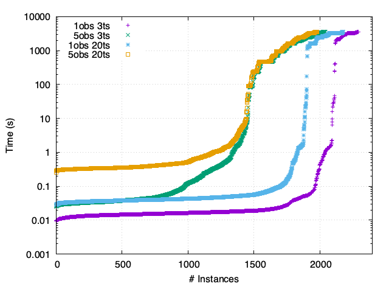
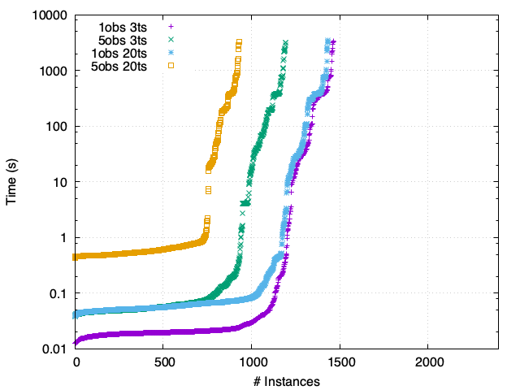
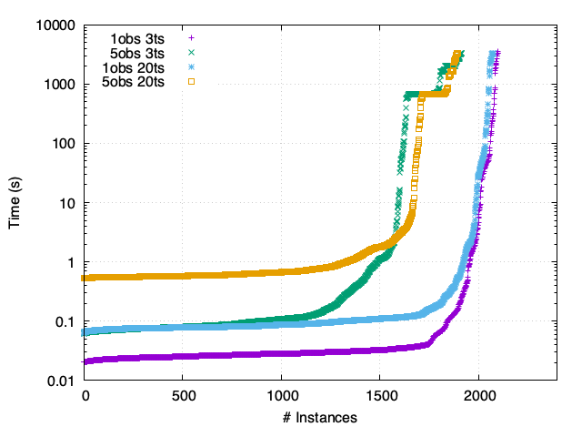
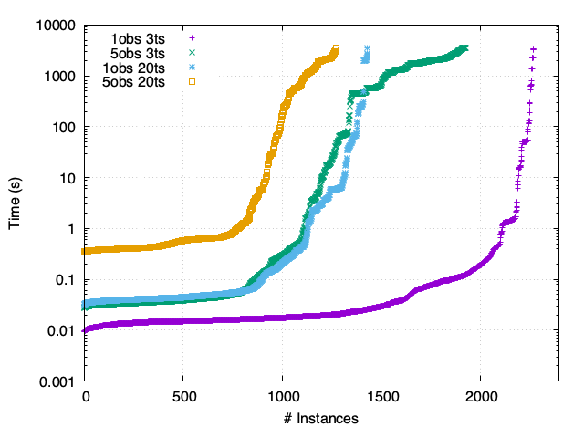
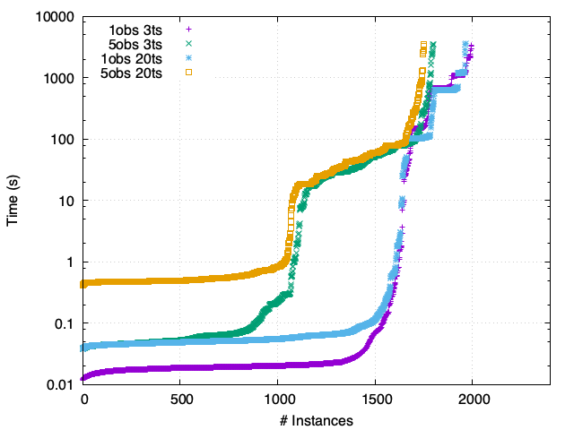
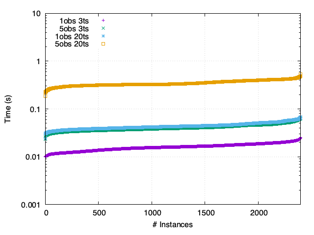
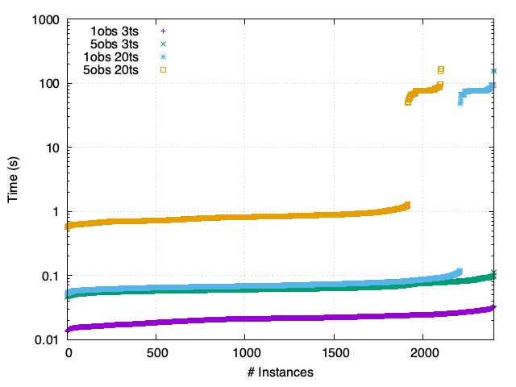
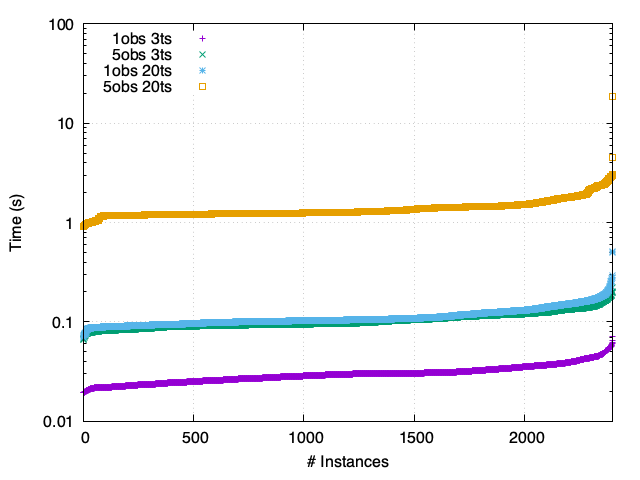
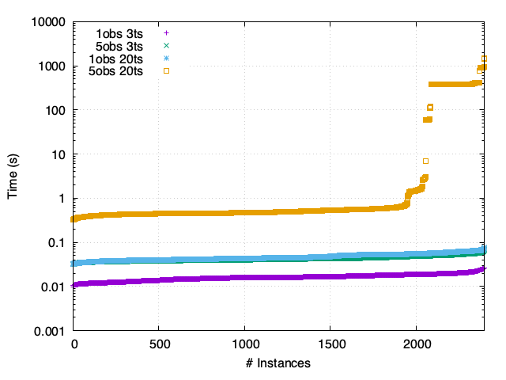
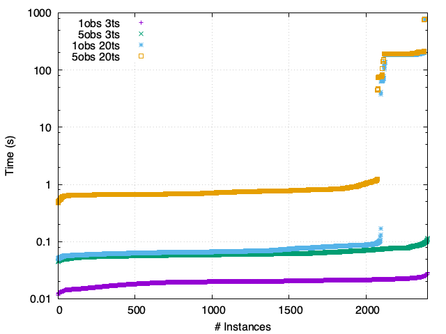

[<< Back](/ModelRevisionASP)
<!--Here are the results obtained with ModRev v1.2-->
## Instances

#### Models
Five well known biological models:
 - **FY**  : Fission Yeast by Davidich and Bornholdt (2008) ([doi:10.1371/journal.pone.0001672](https://doi.org/10.1371/journal.pone.0001672))
 - **SP**  : Segment Polarity (1 cell) by Sánchez *et al.* (2002) ([doi:10.1387/ijdb.072439ls](https://doi.org/10.1387/ijdb.072439ls))
 - **TCR** : TCR Signalisation by Klamt *et al.* (2006) ([doi:10.1186/1471-2105-7-56](https://doi.org/10.1186/1471-2105-7-56))
 - **MCC** : Mammalian Cell Cycle by Fauré *et al.* (2006) ([doi:10.1093/bioinformatics/btl210](https://doi.org/10.1093/bioinformatics/btl210))
 - **Th**  : T-helper Cell Differentiation by Mendoza and Xenarios (2006) ([doi:10.1186/1742-4682-3-13](https://doi.org/10.1186/1742-4682-3-13))

Models were corrupted according to different parameters:
 - **F** : probability of changing a regulatory function
 - **E** : probability of flipping the sign of an edge
 - **R** : probability of removing a regulator
 - **A** : probability of adding a regulator

24 different configurations of corruption parameters were considered and 100 model instances were generated for each configuration.

Generated models can be found [here](https://filipegouveia.github.io/ModelRevisionASP/inputNetworks.zip).

#### Observations

Five sets of observations were generated consistent with the original models under the following update schemes:
 - Synchronous
 - Asynchronous

The observations were generated with a length of 20 time-steps. For the experimental evaluation it were considered also a part of the same observations with only 3 time-steps.

Generated observations can be found [here](https://filipegouveia.github.io/ModelRevisionASP/observations.zip).

## Results

For detailed time results, please check [results-global-v1.2.3.pdf](/ModelRevisionASP/results-global-v1.2.3.pdf).
<!-- For detailed time results, please check [results-v1.2.pdf](/ModelRevisionASP/results-v1.2.pdf). -->
<!-- A table summary of the time results can be found here -->
<!--For a comparative view, please check [here](compare)-->

obs - number of observations

ts  - number of time-steps

    

        <h4>Synchronous</h4>
        

        
        FY - Synchronous
        

        

        
        SP - Synchronous
        

        

        
        TCR - Synchronous
        

        

        
        MCC - Synchronous
        

        

        
        Th - Synchronous
        

    

    

        <h4>Asynchronous</h4>
        

        
        FY - Asynchronous
        

        

        
        SP - Asynchronous
        

        

        
        TCR - Asynchronous
        

        

        
        MCC - Asynchronous
        

        

        
        Th - Asynchronous
        

    

<!--

FY - Synchronous

FY - Asynchronous

SP - Synchronous

SP - Asynchronous

TCR - Synchronous

TCR - Asynchronous

MCC - Synchronous

MCC - Asynchronous

Th - Synchronous

Th - Asynchronous

-->
<!--

    

        <h6>Synchronous</h6>
        

        
        FY
        

    

    

        <h6>Asynchronous</h6>
        

        
        FY
        

    

-->
<!--

    

        
    

    

        
    

-->